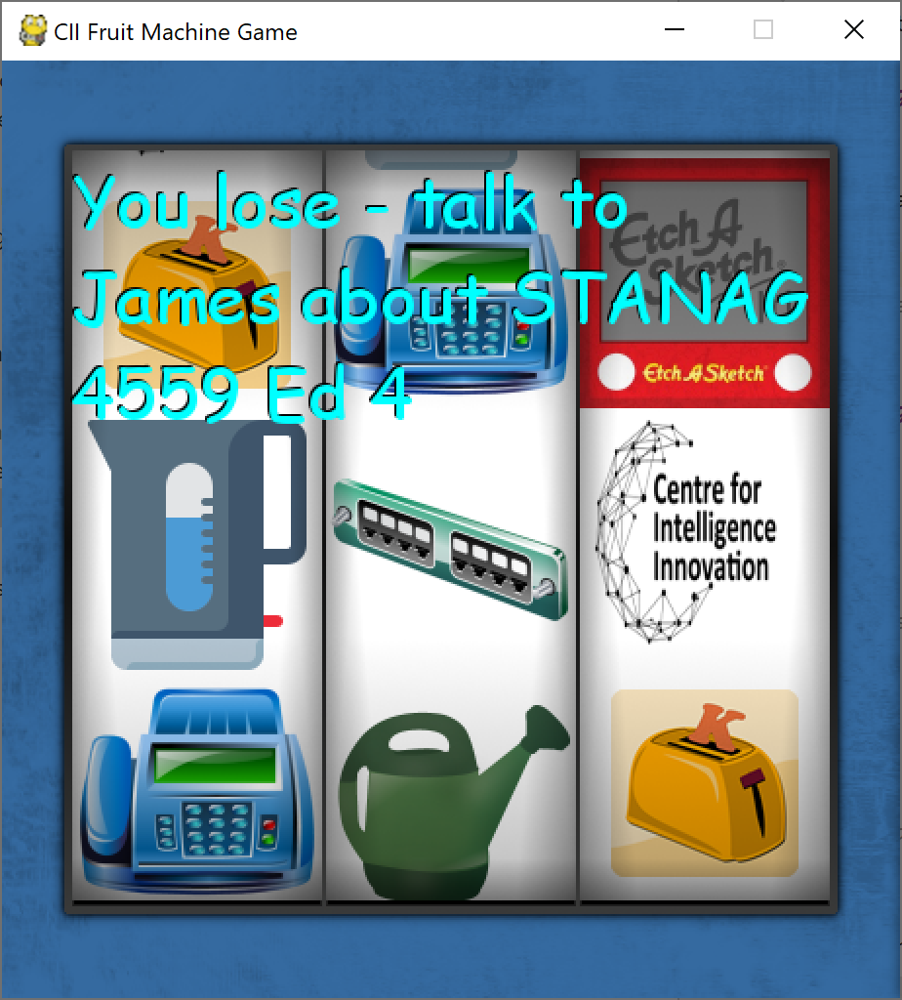

# CII Fruit Machine Game

I initially started writing an awesome new game combining AI, deep learning, augmented & virtual 
reality with blockchain and FPGA/GPU acceleration, all in Python. Depending on your age, 
think of the best bits of Pong / Elite / Doom / Quake / Command & Conquer / Grand Theft Auto / *TODO*: {insert modern
game here}. 

But then I realised that:

1) Thinking about doing something and actually doing it are two very different things.
2) Python isn't even in my top ten list of favourite languages.
3) I'm not very good at drawing things, and most gamers like shiny graphics.
4) My laptop's 130W power supply doesn't work with Virgin's in-seat power (*TODO*: {next time book
Upper class where it definitely does work}), so I've actually only got 1h42m for this instead of 8h28m. 
Nuts.

So instead I've been liberally "inspired" by the Internet and "written" a fruit machine game with a
CII twist.  



# Getting the code

Assuming you are reading this on GitHub, click on the "Clone or Download"..."Download ZIP" button at the top right. For
more advanced users:

```
git clone https://github.com/jrs53/cii-fruit-machine
```

# Running the code

You need python 3.5ish and the pygame library. I'd recommend installing them in a conda environment or a pip virtualenv. 
Ask Matt (or Mr Google) for details:
 
```
conda install -c cogsci pygame
``` 

or

```
pip install -U pygame --user
```

After you have pygame, run the game as follows:

```
python CiiFruitMachine.py
```

# Editing the code

Notepad works, but I prefer PyCharm or Visual Studio Code.

# Things you might want to add

* Use different images or winning/losing phrases
* Add an extra spinner
* More complicated winning rules e.g. diagonals
* Add an Easter Egg so you can cunningly ensure you always win
* Sound effects
* Betting. What else makes watching sport borderline tolerable?
* Fix some bugs. I would like to say I deliberately left some obvious ones in, but that would be a lie. I haven't even 
looked.
* Make the code vaguely compliant with http://google.github.io/styleguide/pyguide.html
* Automated unit and integration tests in line with the Software Project Management Plan
* Make a real fruit machine!
  * https://www.element14.com/community/community/raspberry-pi/raspberrypi_projects/blog/2016/10/24/raspberry-pyslots-the-costume-the-slot-machine-neopixels-pull-arm-and-finishing-things-up
  * https://blog.project-insanity.org/2017/10/28/open-source-powered-gnu-casino-slot-machine/
  * https://micropi.wordpress.com/2017/08/01/how-i-made-a-raspberry-pi-2p-slot-machine/ (extra points for the "case")

# Other games

As far as Python goes, pygame seems quite nice. You can read more here:

* https://www.pygame.org/docs/
* https://www.pygame.org/wiki/tutorials
* https://www.youtube.com/watch?v=FfWpgLFMI7w (Space Invaders tutorial!)

# FAQs

Q: Did this really take less than two hours?
A: No, I'd guesstimate about 9 hours in total. "Fortunately" it seems there isn't much else to do
around Westfields.

Q: Why the choice of icons? A: Good question, can **you** make a patch panel from a toaster, a kettle
and a fax machine?

Q: Do you really now know of any bugs? A: Ok, here are a few:
* Sometimes if the reel spins a long way, the icons are blank
* Sometimes the reel values don't look well aligned
* The text wrapping code seems dodgy at times
* Redrawing could be optimised lots

